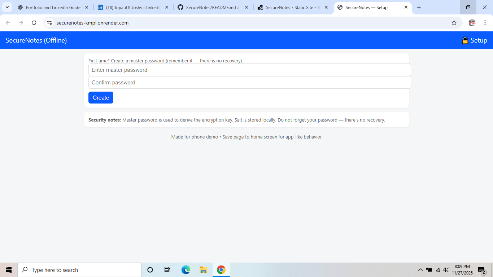
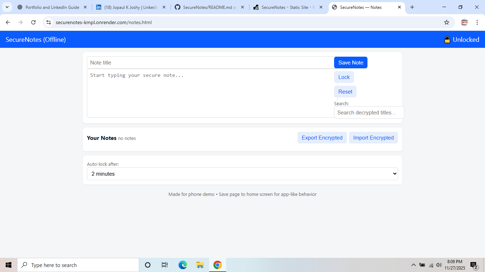

🌍 Live Demo

🔗 App: https://securenotes-kmpl.onrender.com

🔗 Repository: https://github.com/jopaulkjoshy14/SecureNotes

🚀 Features

🔒 Client-side encryption (AES-GCM via Web Crypto API)

🔑 Password-protected login

📝 Create, edit, delete notes securely

💾 Encrypted LocalStorage persistence

🌐 Fully offline – works without internet

🧩 No backend required – pure HTML/CSS/JS

🛡 Clean separation of crypto, storage, and UI logic

📁 Project Structure
SecureNotes/
│
├── index.html            # Login page
├── notes.html            # Notes UI page
│
├── css/
│   └── styles.css        # UI styling
│
├── js/
│   ├── crypto.js         # Encryption/decryption logic
│   ├── storage.js        # LocalStorage management
│   ├── login.js          # Handles login/password flow
│   └── notes.js          # Notes creation/edit/delete logic
│
└── assets/               # (Optional) images/icons

🛠️ Tech Stack

HTML5

CSS3

Vanilla JavaScript (ES6)

Web Crypto API

LocalStorage API

🔐 Encryption Details

SecureNotes ensures maximum privacy using modern cryptographic standards:

PBKDF2 — Secure key derivation from password

AES-GCM (256-bit) — Authenticated encryption

Random salt generation for every key derivation

Random IV for each encryption

Encrypted blobs stored inside LocalStorage

➡️ No data is ever transmitted to any server.
➡️ Your browser is the ONLY place where decryption happens.

📦 Installation & Usage
Option 1 — Clone via GitHub
git clone https://github.com/jopaulkjoshy14/SecureNotes.git
cd SecureNotes

Open index.html in your browser.

Option 2 — Host Locally

Use any local HTTP server:

npx serve
# or
python3 -m http.server

Then open:

http://localhost:3000/

Option 3 — Use the Live Hosted Version

Use the Render deployment here:
👉 https://securenotes-kmpl.onrender.com

📸 Screenshots (Optional)

Add screenshots here for better presentation.

Example:

🚀 Deployment (Render)

This project requires no backend, so deployment is simple:

Build Command: None

Publish Directory: / (root folder)

Render serves static sites directly from the repo.

🧭 Roadmap

 Dark mode UI

 Export/Import encrypted notes

 Search inside notes

 PWA support (Installable app)

 Optional biometric support (WebAuthn)

🤝 Contributing

Contributions, issues, and feature requests are welcome!
Feel free to check the issues page.

📄 License

This project is licensed under the MIT License.
You are free to use, modify, and distribute the software with attribution.

👤 Author

Jopaul K Joshy
🔗 LinkedIn: https://www.linkedin.com/in/jopaul-k-joshy-75a7a6299/
🔗 Portfolio: your link
